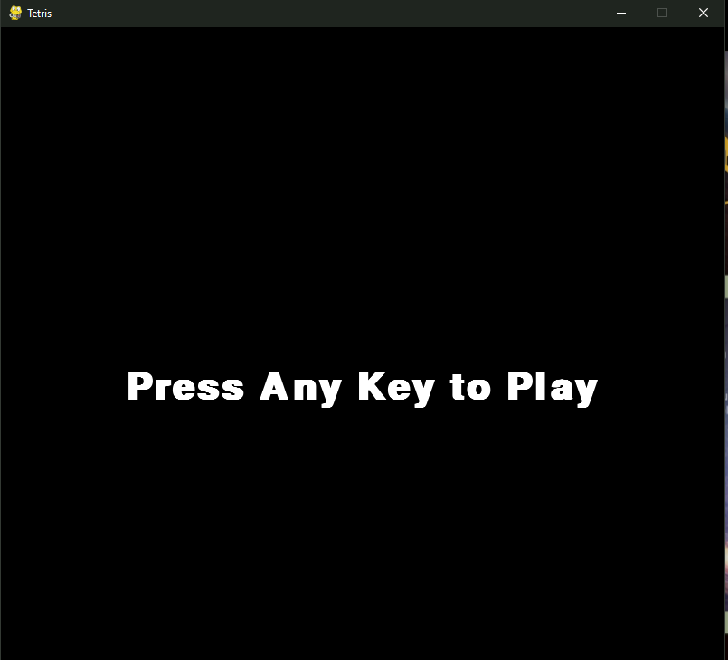

# Tetris-pygame
**<h2>To start the game:</h2>** 

Press the mouse botton or any key
 
 

**<h2>Directions:</h2>** 
<ul>
Use direction keys: 
<li>Left arrow to move left
<li>Right arrow to move right
<li>Down arrow to move faster
<li>Up arrow to change direction
</ul>

